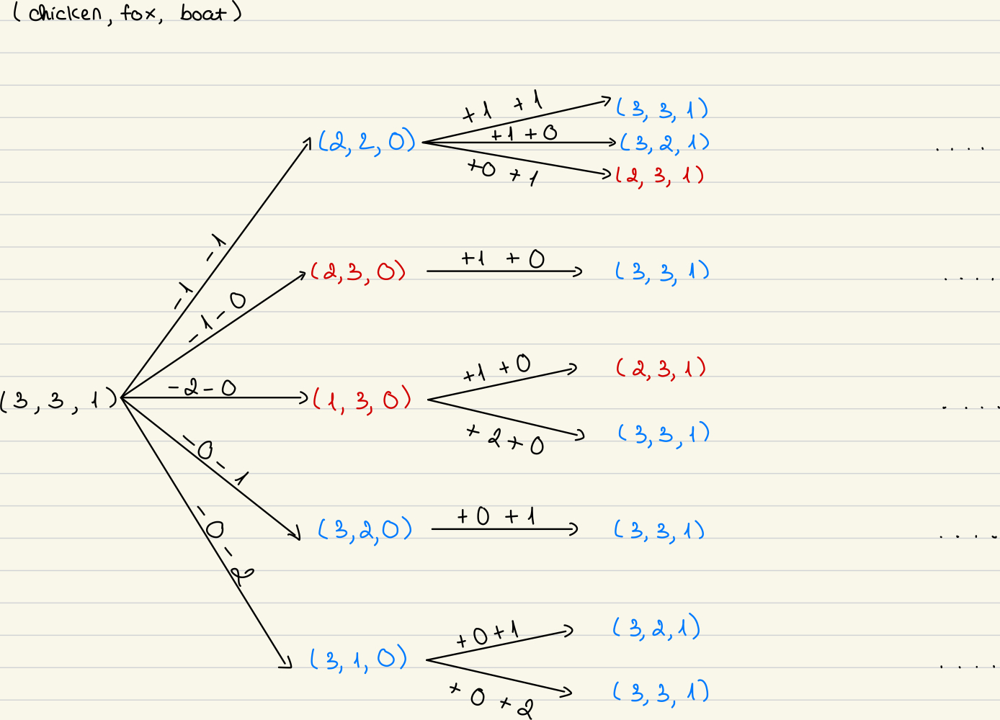

# COSC 76: Artificial Intelligence, 25F, PA1: Chickens and Foxes, Minh Nguyen

## Description

### Implement the model: states and actions

**State**: (chicken, fox, boat) — number of chickens, foxes, and boats at the starting bank of the river
**State space**: graph of tuples (chicken, fox, boat), where states are nodes, and actions are edges
**Start state**: (3, 3, 1) in this case
**Successor function/Action**: moving boat carrying 1 or 2 animals between banks such that either banks has foxes > chickens
**No cost**
Number of states (without considering legality of states) <= `Possible number of chickens` * `Possible number of foxes` * `Possible number of boats` = 4 * 4 * 2 = 32

### Implement breadth-first search

Frontier: collections.deque (FIFO).

Explored set: Python set() on states.

Each SearchNode stores a parent pointer; backchaining reconstructs the path.

Completeness: Yes (finite branching).

Optimality: Yes for unit edge cost → returns a shortest path in steps.

### Implement path-checking depth-first search

No global visited set (memory-light).

Maintains only the current recursion path to block cycles; backtracks with path.pop().

Clear base cases: goal reached; depth limit reached (if used).

Completeness/Optimality: Not guaranteed; purpose here is to practice recursion + path checking.

- Does path-checking depth-first search save significant memory with respect to breadth-first search?  Draw an example of a graph where path-checking DFS takes much more run-time than breadth-first search; include in your report and discuss.
-> Path-checking DFS does save significant memory compared to BFS: `O(m)` vs `O(min(n,b^d))`
-> because path-checking DFS would only store the current path that you're on, it deletes all branches where it messes up which does not lead to the goal (in this implementation).

- Does memoizing DFS save significant memory with respect to breadth-first search?  Why or why not? As a reminder, there are two styles of depth-first search on a graph.  One style, memoizing keeps track of all states that have been visited in some sort of data structure, and makes sure the DFS never visits the same state twice. 
-> Memoizing DFS does not save significant memory compared to BFS: `O(min(n,b^m))` vs `O(min(n,b^d))`
-> because they save all the nodes they have been to in a set (worst case) (DFS stores entire graph in worst case, BFS always stores entire graph)

### Implement iterative deepening search

Outer loop over depth limit `ℓ = 0,1,2,….`

Inner search: recursive path-checking DLS (depth-limited DFS).

First solution encountered is a shortest path (in steps);
Space: `O(b·d)` (like DFS), Time: amortized `O(b^d)` (like BFS), with overhead due to re-expansion.

- On a graph, would it make sense to use path-checking DFS, or would you prefer memoizing DFS in your iterative deepening search?  Consider both time and memory aspects.  (Hint.  If it's not better than BFS, just use BFS.)
-> Path-checking IDS saves a lot of space (`O(d)`), but in terms of time it can re-visit the same state along different paths and across depth limits. This can be costly when the graph has many converging paths.
-> Memoizing IDS grows toward `O(b^d)` in terms of space complexity in the worst case — can approach BFS’s memory usage. However, in terms of time, much less re-expansion; typically far fewer node visits. So just use BFS because its always faster.

## Evaluation

1. Unit tests (representative)

**State safety**:

- `state_safe((3,3,1))` → `True`

- `state_safe((1,2,1))` → `False` (2 foxes > 1 chicken on start bank)

- `state_safe((0,2,0))` → `True` (no chickens on start bank; goal bank has (3,1): safe)

**Successors from start**: Verify the 5 passenger patterns generate only in-bounds, safe successors and match your lecture’s lexicographic order if required (optionally `successors.sort()`).

**BFS shortest path check**:
For classic (3,3,1) and the more interesting (5,4,1), BFS returns a path whose depth matches IDDFS’s first-found depth. This validates IDDFS optimality-in-steps.

**DFS recursion & path-checking**:
Verified no infinite self-loop on (A→A)-style edges (blocked by “on-path” set / list).

2. Empirical behavior (qualitative)

**BFS**: Usually explores fewer unique depths due to level-order nature, but memory grows toward `O(b^d)` (frontier explosion).

**IDS**: Dramatically smaller memory; time overhead from re-expanding nodes at each shallower limit is noticeable but acceptable for small branching factors (this problem).

**DFS (path-checking)**: Tiny memory footprint; may dive deep into dead branches; not guaranteed to find shortest solutions and can be much slower than BFS on some graphs.

3. Common bugs & how I avoided them

Predation test too strict: Disallowing f > c even when c == 0 leads to pruning legal states. Fix: only unsafe if chickens present and foxes > chickens on that bank.

Backtracking missing: Forgetting path.pop() corrupts the current path and causes spurious cycle hits.

Depth-limit off-by-one: Stop at depth == limit (after goal-check), do not expand children.

Overwriting algorithm labels: DFS initializing a new SearchSolution("DFS") overwrote IDDFS’s label. Fix: only create `SearchSolution` if not provided; or relabel on return in IDS.

## Discussion questions

- Lossy chickens and foxes: Every fox knows the saying that you can't make an omelet without breaking a few eggs.  What if, in the service of their faith, some chickens were willing to be made into lunch?  Let us design a problem where no more than E chickens could be eaten, where E is some constant.  What would the state for this problem be?  What changes would you have to make to your code to implement a solution?  Give an upper bound on the number of possible states for this problem.  (You need not implement anything here.)
-> state would be the same (number of chickens, number of foxes, number of boats)
-> in `FoxProblem`, function 'state_safe', check if 'chicken < fox - E' or 'other_chicken < other_fox - E' because at most E chickens can be eaten
-> number of possible states <= `number of chickens + 1` * `number of foxes + 1` * `number of boats + 1` (don't change)

